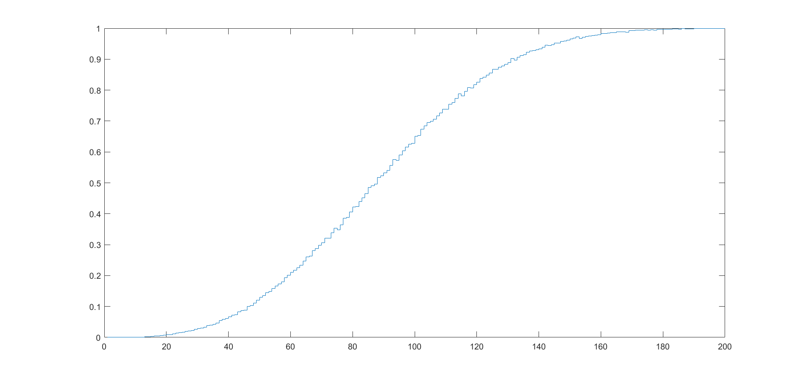

# About

Many people have heard of the birthday paradox: the counterintuitive fact that in a room of just 23 people, there is a 50% chance that at least two of them share the same birthday. That got me thinking. What is the probability in a room of n people that at least three of them share the same birthday? How many people do you need in a room for there to be a similarly-high 50% chance of a shared birthday? This repository consists of an explanation of the math I came up with and some MATLAB programs I wrote to help answer this question.

# Results

The explanation I came up with can be found in [Birthday-triplets.pdf](Birthday-triplets.pdf).

Below are three charts I generated. 

This chart shows the computed probabilities based on the math I came up with. 

This graph is a symbolically calculated equivalent, which took a very long time to run. I ran this because I noticed a slight distortion on the graph at ~n=130 which is caused by floating point precision errors.

Finally, I created a simulation to get a general idea of whether I was in the right ballpark. The results line up very nicely.

# Files
Inside MATLAB Computation/ are the programs I wrote to calculate the probability and run the simulation.

Inside Figures are the charts I displayed, as well as a MS Excel file with the symbolically-computed probabilities.

Inside Tex is the tex document I wrote the explanation in.