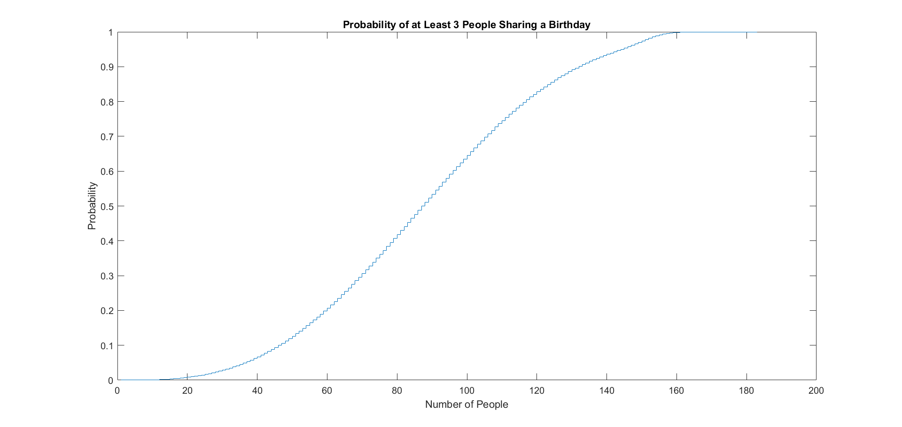
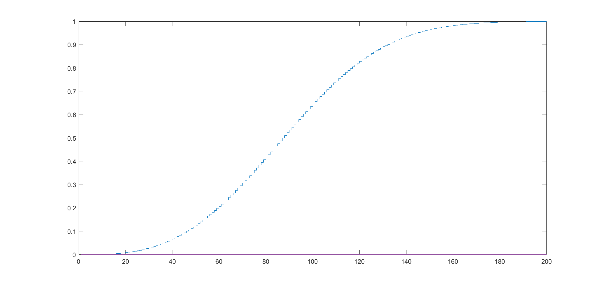

# About

Many people have heard of the birthday paradox: the counterintuitive fact that in a room of just 23 people, there is a 50% chance that at least two of them share the same birthday. That got me thinking. What is the probability in a room of n people that at least three of them share the same birthday? How many people do you need in a room for there to be a similarly-high 50% chance of a shared birthday? This repository consists of an explanation of the math I came up with and some MATLAB programs I wrote to help answer this question.

# Results

The explanation I came up with can be found in [Birthday-triplets.pdf](Birthday-triplets.pdf).

To answer this question I first wrote a random simulation to get a general idea. This simulation was an efficient way of knowing whether I was in the right ballpark. I used this to verify my results later on.